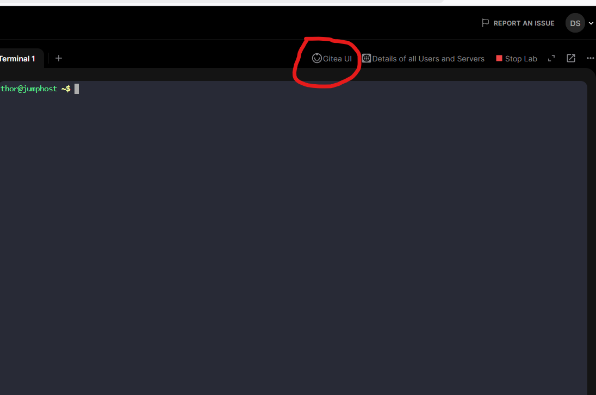
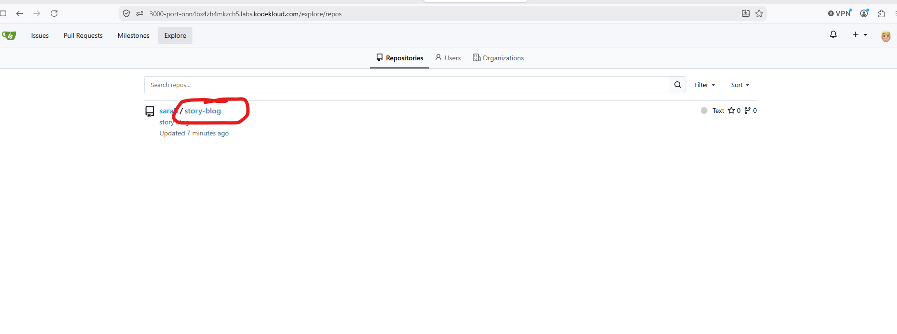
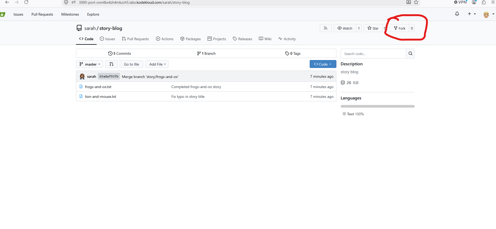
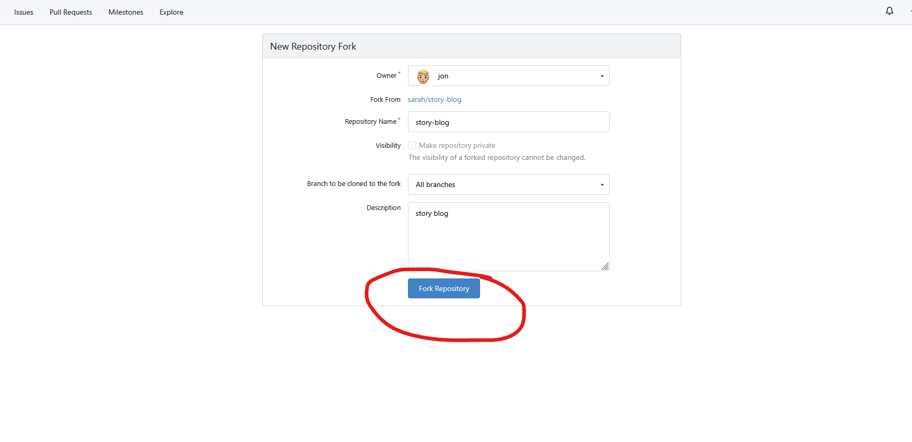

# Date: 2026-09-18
---
# [Goal]
There is a Git server utilized by the Nautilus project teams. Recently, a new developer named Jon joined the team and needs to begin working on a project. To begin, he must fork an existing Git repository. Follow the steps below:

    Click on the Gitea UI button located on the top bar to access the Gitea page.

    Login to Gitea server using username jon and password Jon_pass123.

    Once logged in, locate the Git repository named sarah/story-blog and fork it under the jon user.

Note: For tasks requiring web UI changes, screenshots are necessary for review purposes. Additionally, consider utilizing screen recording software such as loom.com to record and share your task completion process.

# [Pseudocode]

# [To-Do-List]
- [gittea uei location]

- [find repo]

- [select repo]

- [fork]

- [confirm]

# [Edges]
- Edge: []
- Fix: []

# [Status: Success / Failure]
- Notes:
